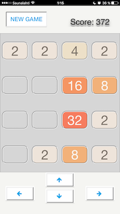
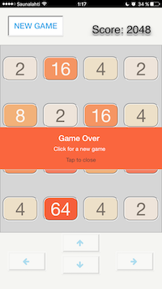

2048v
==============

[You can try here](https://v2048.herokuapp.com)

Simple Vaadin application that only requires a Servlet 3.0 container to run. It has Jetty server embedded into war file

Workflow
========

Basic Vaadin web classic 2048 game with Vaadin Touchkit included.

Views
-------------------------

|   Game on     |   Game over   |
| ------------- | ------------- |
|   |   |

LICENSE
========

Running project locally
-------------------------

From Vaadin template doc...
To compile the entire project, run "mvn install".
To run the application, run "mvn jetty:run" and open http://localhost:8080/ .
